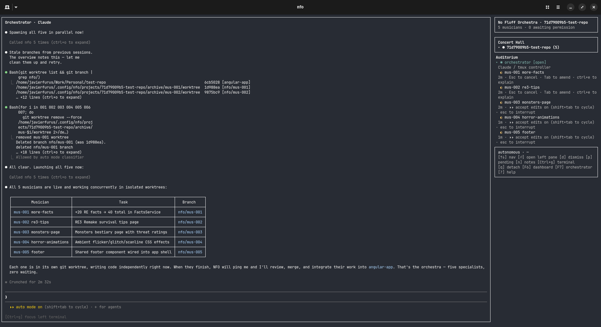
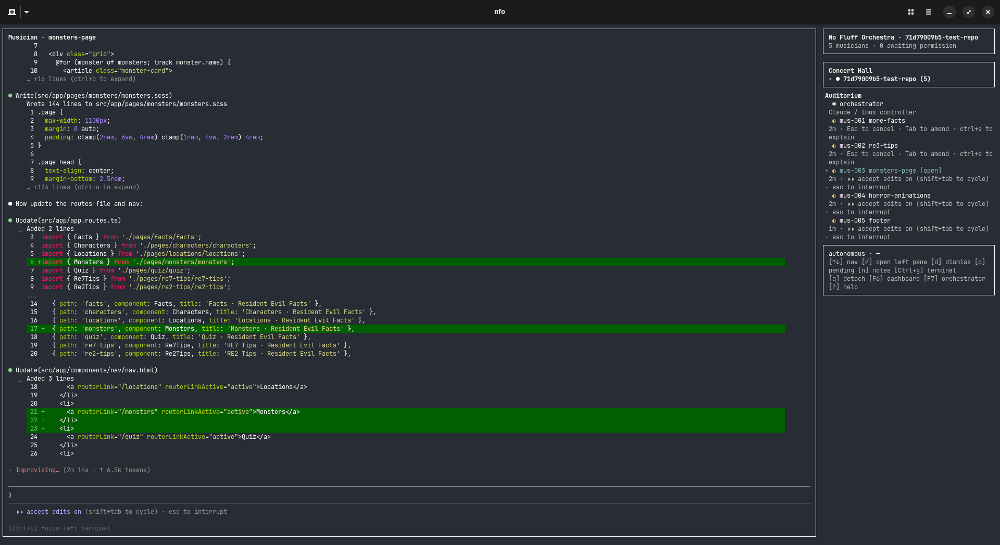

# NFO — No Fluff Orchestra

> [!WARNING]
> NFO Is highly experimental, things can break, might not work as expected or the composed music might suck!

<p style="text-align: center"></p>

> (Yes, I know orchestrators don't have staffs - but look how happy he is)

A simple, "no fluff" orchestrator that doesn't overcomplicate your workflow. Tell the **Orchestrator** what you want to do and he will spread the work across multiple **Musicians**!

> [!NOTE]
> I am not a musician. I do not take responsibility for any misused musical terminology!

## Why?
Honestly? Because I wanted to see if I could do it. Apart from that, the main reason why NFO exists is because I wanted an agent orchestrator that is not too bloated and allows you to see your agents without obfuscation. This is a learning project for me to understand agents better and to learn some (weird flavor of) React.

I wrote it by hand and with Claude - MVP was built almost entirely by Claude then I overtook and refactoring work along with new features are hand-built by me.

## How does it work?

Just start NFO in your project's folder and you are good to go!

```bash
nfo
```

This will create an **Orchestra** with your project's name and an **Orchestrator**. From here on out this Orchestra will be running until you kill it - this means that you can fire away your tasks and work on something else in the meantime. 

Everything that you have in your regular Claude session is available in your NFO session. Just ask your Orchestrator what you want to do, and it will do it for you by spawning several **Musicians** to tackle the task. 



These Musicians are either `Sonnet` or `Haiku` agents used to explore your codebase or code. Using **Hub-and-Spoke** the agents communicate with the Orchestrator and the Orchestrator decides the next steps. This structure allows the smarter model to keep its context clean and save cost by using other models at what they are best. They are all assigned to your Orchestra and you can freely move between them, see what they are doing or steer them by using `/btw`. You can also ask your Orchestrator to tell them what to do!



They can work in parallel or sequentially, depending on what the task demands. NFO leverages **worktrees** to keep your environment clean and avoid agents stepping on each other's toes.

### Notes, notes notes!
Notes are automatically generated by the Musicians and the Orchestrator to keep track of what has been done so far in the codebase, keep track of quirks and pitfalls. This serves as a quasi memory and helps the agents work in a continuous workflow.

### I like control
During the entirety of the process you decide how much you want to be in control. You want fully automated? You got it. You want to approve some non-whitelisted requests? Do it. Have granular control and approve everything by hand? Whatever floats your boat.

Communication happens through Tmux and an MCP server, the Ink based UI wraps Claude Code and provides it for you for interaction.

### I am ~~no~~ Superman

`Superpowers` are supported and the skill knows that instead of regular subagents it should deploy Musicians to finish the tasks. It also recognizes that some tasks can be tackled sequentially or parallel as well.

### I had enough, let me go.

You can dismantle your currently running Orchestras by simply running

``` bash
nfo --kill <orchestra-id>
```


## Limitations
NFO is currently very experimental. There are many things that will change, improve or well, break.

Here are the currently known limitations and what should come in the future:

- [ ] No package, NFO can only be run after being built (I am planning to ship through `npm` and `brew`)
- [ ] Worktrees are not always cleaned up properly
- [ ] Currently, the tools available to the musicians are not limited
- [ ] The notes section is broken
- [ ] Provide a simpler way to manage orchestras
- [ ] Performance can degrade over time
- [ ] The TUI can flicker because of the Node-PTY embedding
- [ ] The current Tmux based communication can be flaky

## Requirements (These are bound to change as the project matures)

- Node.js 20+
- `tmux` on PATH
- `claude` (Claude Code CLI) on PATH, version ≥ 2.1 (see `src/claude-detect.ts`)
- `bash` or `zsh`
- Linux or macOS (Windows via WSL only for now)

## Install (development)

```
git clone https://github.com/javierfurus/nfo.git
cd nfo
npm install
npm run build
npm link    # makes the `nfo` command globally available
```

## Use

In a git repo: `nfo`
List orchestras: `nfo list`
Attach by id: `nfo <id>`
Tear down: `nfo kill <id>`
Open notes: `nfo notes <id>`

## Musicians

Inside an orchestra, the Orchestrator can use these MCP tools:

- `spawn_musician({ name, task })` — create a Musician in an isolated git worktree
- `message_musician({ musician_id, message })`
- `query_musician({ musician_id, lines? })` — read recent pane output
- `list_musicians()`
- `dismiss_musician({ musician_id, archive_worktree? })` — archived = worktree preserved under `archive/`, branch kept; dropped = worktree gone, branch deleted
- `report_done({ summary })` — called by Musicians on completion
- `note_write` / `note_read` / `note_list` — Orchestrator's persistent notes

To watch a Musician work just go to the sidebar (if not already there) by `Ctrl + g` and move the cursor to the Musician you want to observe. Press `Enter/Return` and you are in that session.

## Copyright
Claude is a trademark owned by Anthropic.

The Claw'd art was done by me. Maybe this was the _real_ reason this project exists so that I could to that.